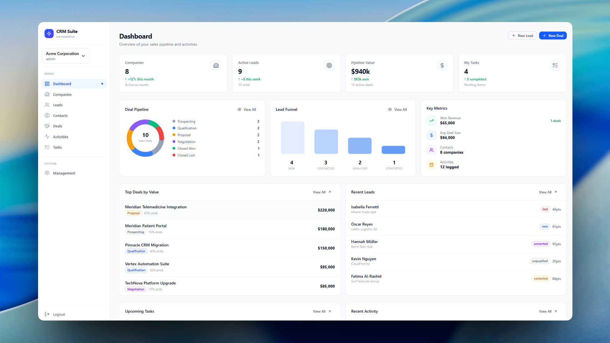
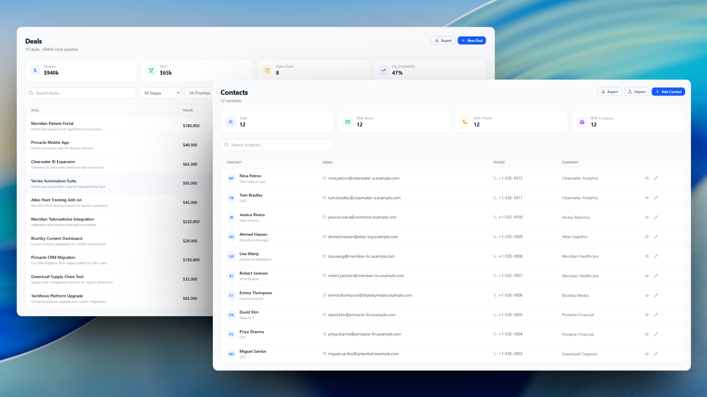
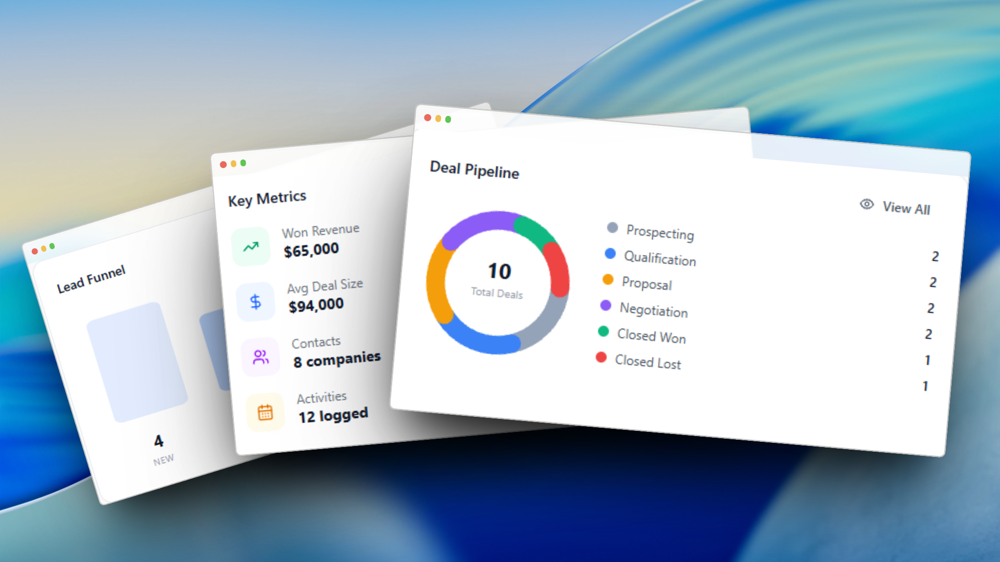
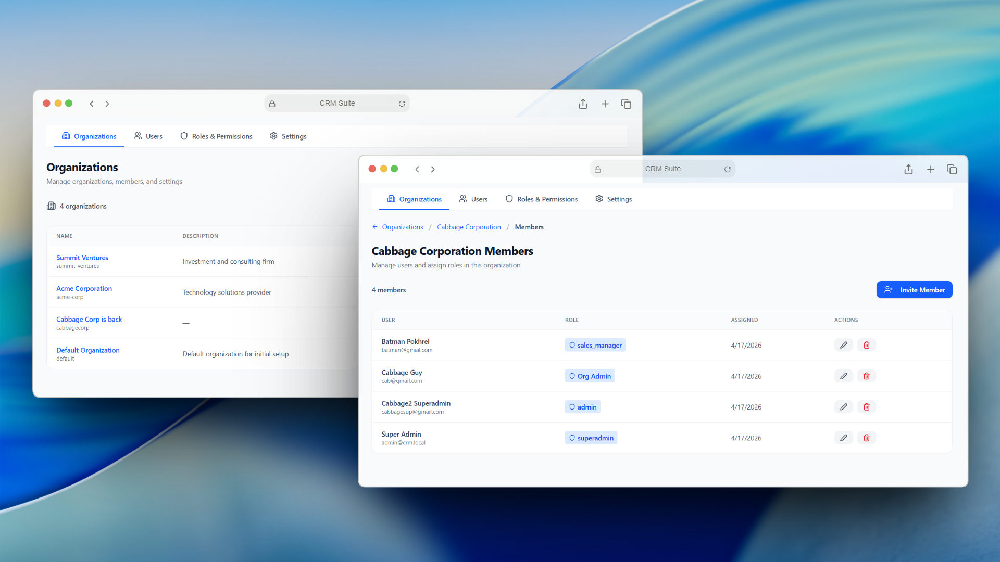
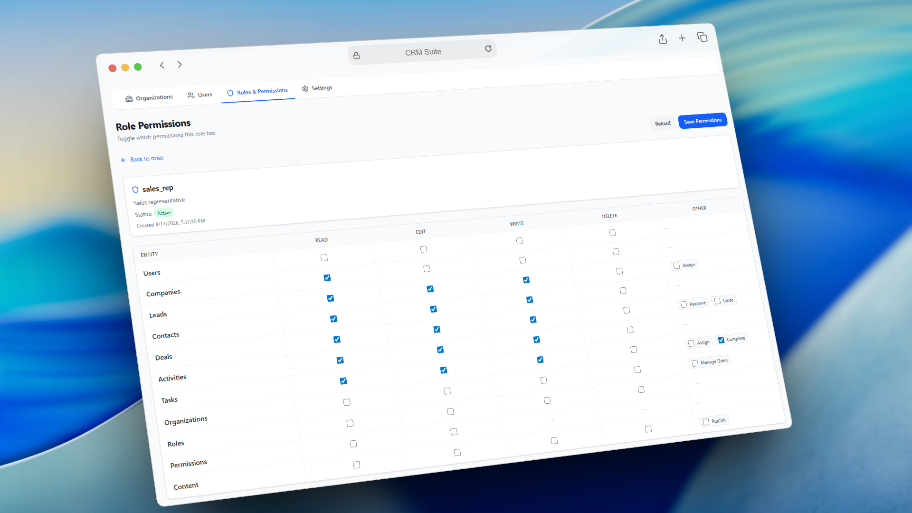
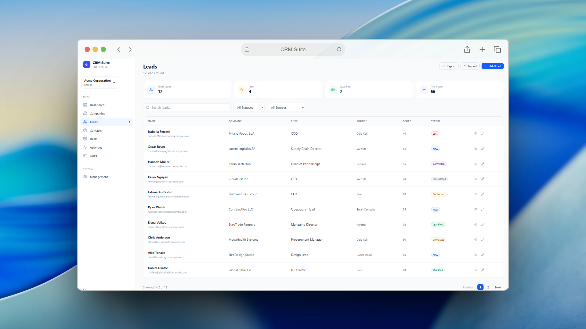
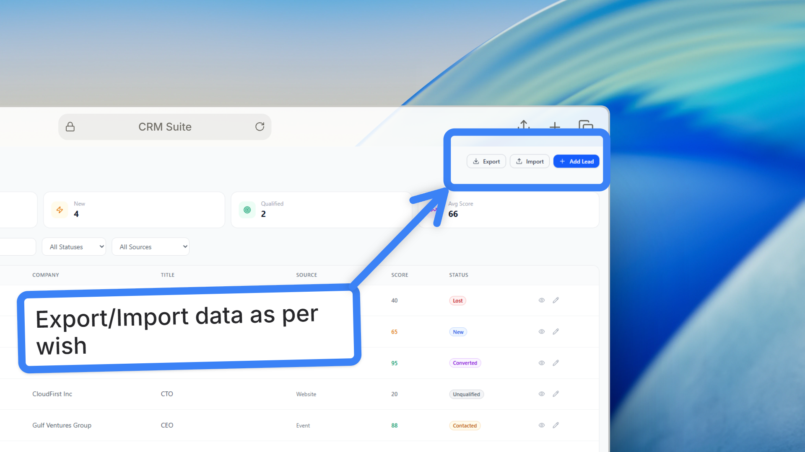

# CRM Suite

Multi-tenant CRM platform built with NestJS, PostgreSQL, and microservice architecture. Manages leads, deals, contacts, companies, activities, and tasks with organization-scoped data isolation and granular RBAC.

<!-- Architecture diagram placeholder -->

## Screenshots















## Tech Stack

| Layer | Technology |
|---|---|
| Runtime | Node.js, TypeScript (strict) |
| Framework | NestJS 11 (monorepo) |
| Database | PostgreSQL, TypeORM |
| Auth | JWT, Passport.js, bcrypt |
| Authorization | CASL with hierarchical permission scopes |
| Email | BullMQ, MJML, Handlebars, Nodemailer |
| Validation | class-validator, class-transformer |
| Architecture | CQRS, event-driven microservices |
| Package Manager | pnpm |

## Monorepo Structure

```
apps/
  crm/                    # Main API
  email-service/          # Email microservice (event-driven, BullMQ)
  messaging-service/      # Messaging microservice (scaffolded)
libs/
  common/                 # Shared types, events, constants, permissions
scripts/                  # Migrations, seed scripts
static/
  email-templates/        # MJML templates with layouts and partials
```

## Architecture

<!-- System architecture diagram placeholder -->

### Multi-Tenancy
- Organization-based data isolation with tenant-aware base service
- Users belong to multiple organizations with distinct roles
- Automatic query scoping per active tenant

### RBAC / Permissions
- CASL-powered permission engine with 6 scopes: Global, Company, Department, Team, Self, Owner
- Role-based permission assignment per resource and action
- Permission guard enforced on every protected endpoint

### Email Microservice
- Decoupled from main API via NestJS microservices
- BullMQ job queue for reliable async delivery
- MJML templates compiled to responsive HTML
- Event-driven triggers (user registration, etc.)

### API
- RESTful with consistent CRUD patterns and DTO validation
- Pagination, filtering, proper HTTP status codes

## API Endpoints

| Resource | Endpoints | Description |
|---|---|---|
| `/auth` | `POST /login`, `POST /register`, `GET /me`, `GET /permissions` | Authentication |
| `/users` | `POST`, `GET /:id`, `PUT /:id`, `DELETE /:id` | User management |
| `/organizations` | Full CRUD + `/stats`, `/users` | Tenant management |
| `/leads` | Full CRUD + `PATCH /:id/status` | Lead tracking |
| `/deals` | Full CRUD + `GET /pipeline` | Deal pipeline |
| `/contacts` | Full CRUD | Contact management |
| `/companies` | Full CRUD | Company management |
| `/activities` | Full CRUD + `GET /upcoming` | Activity logging |
| `/tasks` | Full CRUD + `/my-tasks`, `/overdue`, `/:id/complete` | Task management |
| `/roles` | Full CRUD + `/:id/permissions` | Role and permission management |

## Database Schema

<!-- ER diagram placeholder -->

13 entities with full relational mapping:

| Entity | Purpose |
|---|---|
| User | Credentials and profile |
| Organization | Tenant boundary |
| UserOrganizationRole | User-org-role mapping |
| Role, RolePermission, UserRole | RBAC system |
| Company | Business profiles |
| Lead | Sales leads with scoring |
| Contact | Contact records |
| Deal | Pipeline opportunities |
| Activity | Interaction logs |
| Task | Assignable work items |

## Getting Started

### Prerequisites

- Node.js >= 18, PostgreSQL >= 14, pnpm >= 8, Redis

### Setup

```bash
pnpm install

# Configure .env (DB, JWT, Redis, SMTP credentials)

pnpm run migration:run
pnpm run seed:permissions
pnpm run seed:demo          # optional, populates sample data
```

### Run

```bash
pnpm run start:dev          # API on http://localhost:3000
pnpm run start email-service  # optional
```

## Scripts

| Script | Description |
|---|---|
| `start:dev` | Development with hot reload |
| `start:prod` | Production mode |
| `build` | Build all apps |
| `migration:generate` | Generate migration |
| `migration:run` | Run migrations |
| `migration:revert` | Revert last migration |
| `seed:permissions` | Seed roles and permissions |
| `seed:demo` | Seed demo data |
| `test` | Unit tests |
| `test:e2e` | E2E tests |
| `lint` | Lint and fix |

## License

MIT
